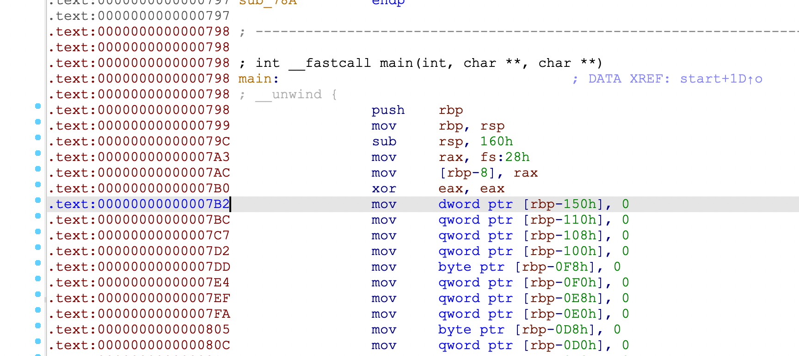
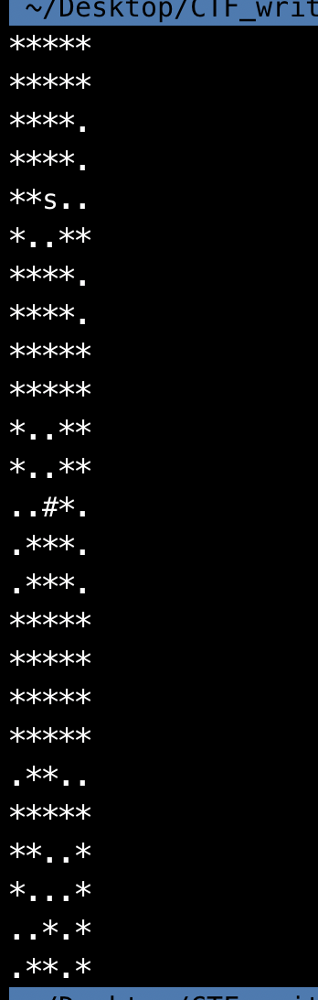
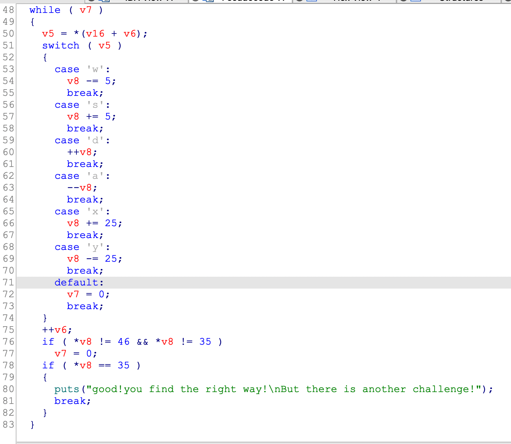
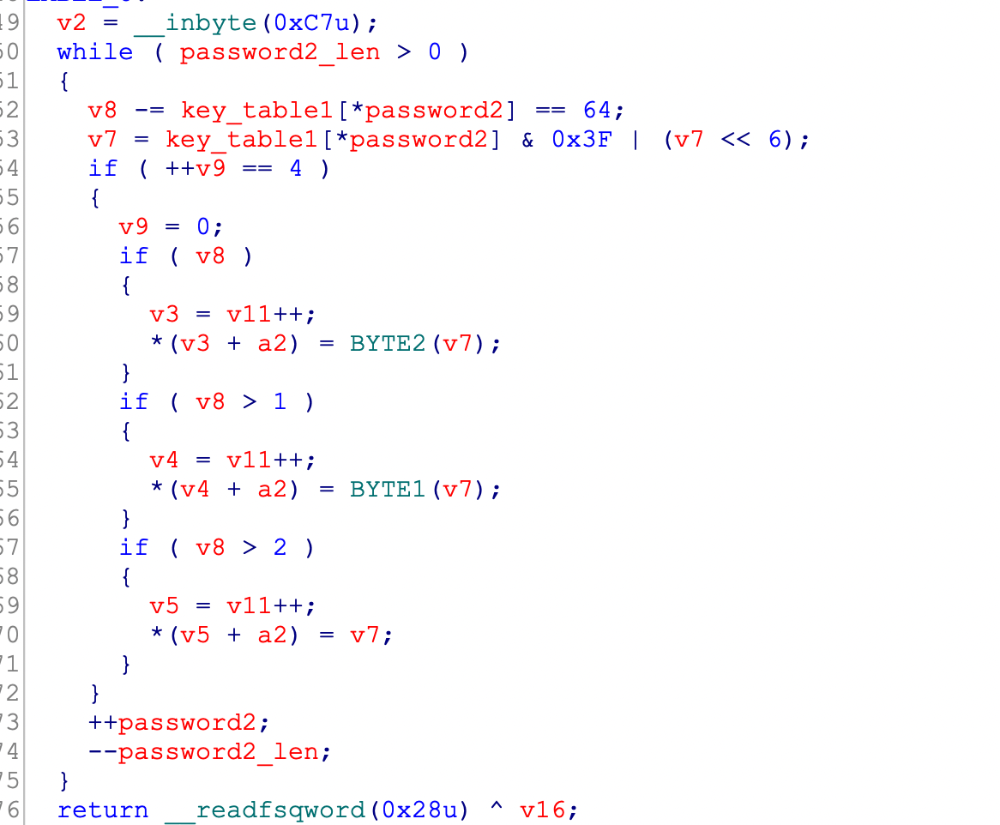
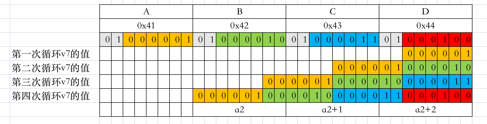
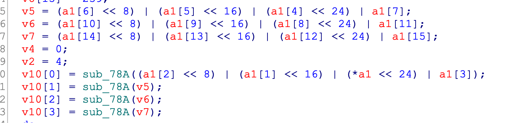
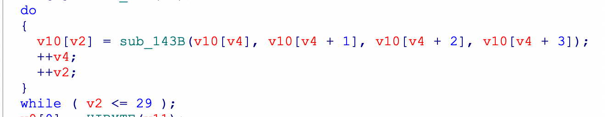
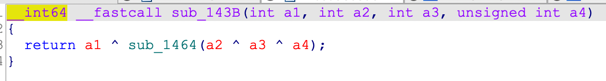
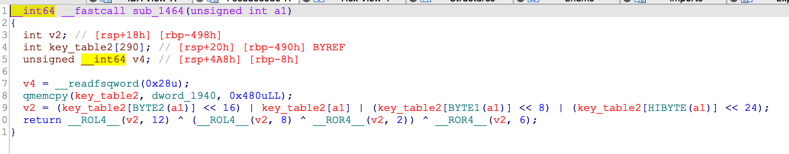
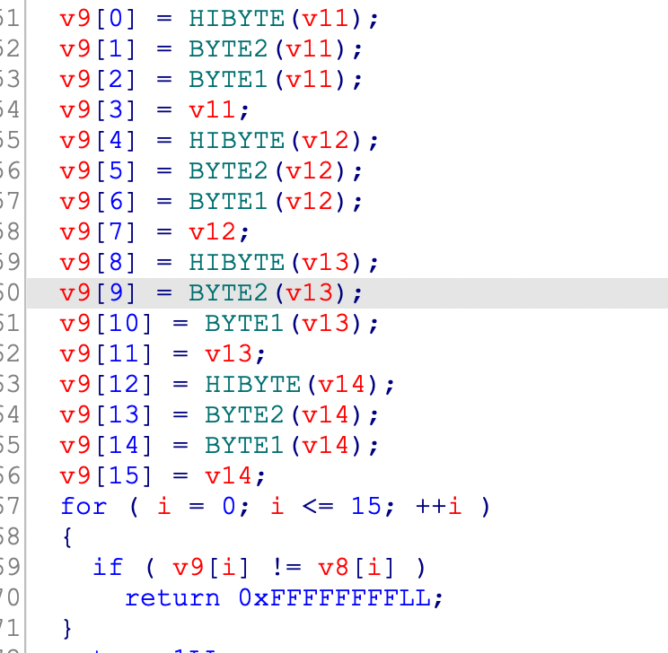

## 0x001 分析程序逻辑

使用IDA pro打开软件，来到main函数中，但是代码处显示红色，而且无法创建函数。



这是由于程序里存在花指令，导致IDA无法正常解析，需找到并nop掉花指令后，再使用快捷键p创建函数，之后就可以正常分析了。

其中的一处花指令如下：


去除完花指令，查看main函数内容：

1. 提示输入 **password1**；
2. 对 **password1** 进行校验，校验通过后，提示输入 **password2**；
3. 对 **password2** 进行校验，校验通过后，提示输入 **password3**；
4. 对 **password3** 进行校验，校验通过后，输出 **flag**；

三个输出对应了三个加密函数，输入彼此间没什么关联，最后的flag就是将这三个输出拼接到一起的。

## 0x002 第一个算法

第一个加密处对应的是一个 **5 * 25** 的迷宫，迷宫形状如下：



走迷宫对应的规则如下：



总共六个操作：
1. w：向上一步
2. s：向下一步
3. d：向左一步
4. a：向右一步
5. x：向下五步
6. y：向上五步

每走一步，都会进行判断，如果走到的是 **\*** 符号，则失败；如果走到的是 **#** 符号，则成功。

按理说操作应该是很简单的，直接四步 **sxss** 即可走到 **#** 处，获得胜利。但是这个程序应该是存在bug或者多解，最后的flag输入 **sxss** 并不对。。。。猜测出题者有可能是想让把所有的 **.** 符号都走一遍。。。。不管他了，思路更重要！

## 0x002 第二个算法

第二个算法是对输入的 **password2** 进行一系列操作后等于 **sctf_9102** 就对了。下面来详细看看这个一系列操作。



代码首先根据输入字符的ascii码，在 **key_table1** 中索引出相对应的值，然后和 **0x3F** 进行按位与操作，之后同 **v7<<6** 进行按位或操作，重复4次后，将 **v7** 值的每8bit位，赋给 **a2** 的三个值中，也就是说每次从输入的字符串中取出4个字符，进行操作之后变为三个字符。

**0x3F** 的二进制表示为 **111 111**，按位与 **0x3F** 就表示只取低6位。**v7<<6** 为左移6位。因此，**key_table1[\*password2] & 0x3F | (v7<<6)** 可解读为 **v7** 左移6位后补的0，由 **key_table1[\*password2]** 的低6位填充。

图解示意图如下：



分析到这，发现这种 **4变3** 的操作应该就是base64解码。然后对照着base64编码表看了下 **key_table1** 就实锤了。

## 0x004 第三个算法



首先是将输入的字符串每四个字符为一组，将这四个字符转换为整数。如 **ABCD** 转换完等于 **0x41424344**，后面的 **sub_78A** 中调用是 **_byteswap_ulong(a1)**， 该函数是将大端序转换为小端序，如 **0x41424344** 转换成小端序就等于 **0x44434241**。

然后对转换完的整数进行加密：





这里总共进行了26次循环，每次循环都将前四个数据的加密结果赋值给第五个，如此循环。

```
v10[4] = v10[0] ^ encode(v10[1] ^ v10[2] ^ v10[3])
v10[5] = v10[1] ^ encode(v10[2] ^ v10[3] ^ v10[4])
...
...
v10[29] = v10[25] ^ encode(v10[26] ^ v10[27] ^ v10[28])
```

由此可见v10数组里总共30个元素，前四个元素是由输入转换的初始值，后面的元素都是由其前四个元素计算得到的。

算法首先是异或，然后将异或的结果分为四个8bit位的值，将这四个值作为下标从 **key_table2** 表中获取数据，然后将从表中取出的四个数据按照高低位重新组合，最后再进行循环左移和循环右移。

最后是校验：



将加密完的数据从高位到低位，每8bit位做为一个字符赋值给 **v9**，然后比较。

## 0x005 解密获取Flag

python3解密代码如下：

```

```

## 0x006 附录-BYTEn

0x41424344

低8位数据 = 0x44

BYTE1 = 0x43

BYTE2 = 0x42

高8位数据 HIBYTE = 0x41