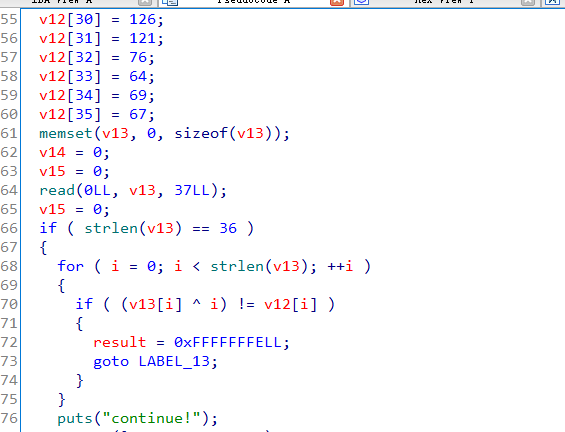
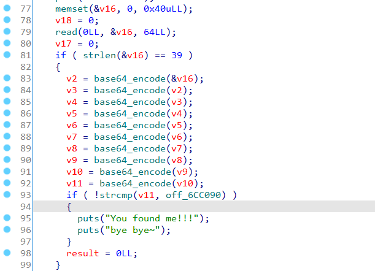
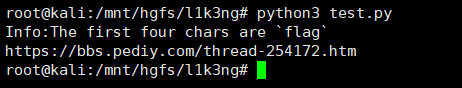
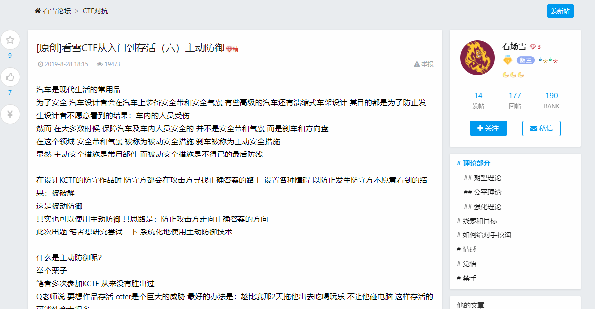
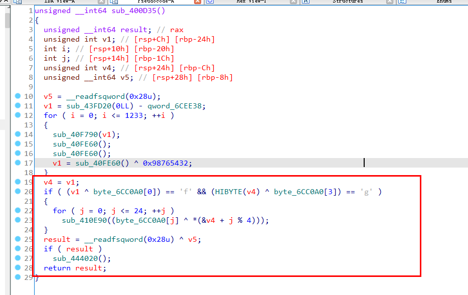

## 0x001 分析程序逻辑

直接来到main函数中，程序逻辑也很简单，分为两部分加密。



首先是接收输入36个字符，然后同下标进行异或运算，再和 **v12** 进行比较。



第二部分首先接收输入39个字符，然后进行了10此的base64加密，最后与 **off_6CC090** 进行比较。

## 0x002 加密算法分析

这两个加密算法都很简单，可以直接进行逆向解密。

首先是异或

```
table1 = [0x49, 0x6f, 0x64, 0x6c, 0x3e, 0x51, 0x6e, 0x62,
          0x28, 0x6f, 0x63, 0x79, 0x7f, 0x79, 0x2e, 0x69,
          0x7f, 0x64, 0x60, 0x33, 0x77, 0x7d, 0x77, 0x65,
          0x6b, 0x39, 0x7b, 0x69, 0x79, 0x3d, 0x7e, 0x79,
          0x4c, 0x40, 0x45, 0x43]

for i,j in enumerate(table1):
    print (chr(i^j),end="")
print ()
```

然后是base64解密

```
data = "Vm0wd2VHUXhTWGhpUm1SWVYwZDRWVll3Wkc5WFJsbDNXa1pPVlUxV2NIcFhhMk0xVmpKS1NHVkdXbFpOYmtKVVZtcEtTMUl5VGtsaVJtUk9ZV3hhZVZadGVHdFRNVTVYVW01T2FGSnRVbGhhVjNoaFZWWmtWMXBFVWxSTmJFcElWbTAxVDJGV1NuTlhia0pXWWxob1dGUnJXbXRXTVZaeVdrWm9hVlpyV1hwV1IzaGhXVmRHVjFOdVVsWmlhMHBZV1ZSR1lWZEdVbFZTYlhSWFRWWndNRlZ0TVc5VWJGcFZWbXR3VjJKSFVYZFdha1pXWlZaT2NtRkhhRk5pVjJoWVYxZDBhMVV3TlhOalJscFlZbGhTY1ZsclduZGxiR1J5VmxSR1ZXSlZjRWhaTUZKaFZqSktWVkZZYUZkV1JWcFlWV3BHYTFkWFRrZFRiV3hvVFVoQ1dsWXhaRFJpTWtsM1RVaG9hbEpYYUhOVmJUVkRZekZhY1ZKcmRGTk5Wa3A2VjJ0U1ExWlhTbFpqUldoYVRVWndkbFpxUmtwbGJVWklZVVprYUdFeGNHOVhXSEJIWkRGS2RGSnJhR2hTYXpWdlZGVm9RMlJzV25STldHUlZUVlpXTlZadE5VOVdiVXBJVld4c1dtSllUWGhXTUZwell6RmFkRkpzVWxOaVNFSktWa1phVTFFeFduUlRhMlJxVWxad1YxWnRlRXRXTVZaSFVsUnNVVlZVTURrPQ=="

for i in range(10):
    data = base64.b64decode(data).decode()

print (data)
```

运行脚本获取flag



flag在哪？？？？

打开解密出来的网站



看完之后发现被骗了。。。。真正的flag加密算法不在这里。。。

## 0x003 真正的加密算法

再次回到ida，经过一番分析之后，发现真正的加密函数就在主函数之后。



这个地方才是真的flag加密算法。

函数中，首先获取一个 **v1** 值（具体怎么获取的就不详细分析了），然后 **v1** 和 **byte_6CC0A0[0]** 进行异或的结果为 **'f'**，**v4** 和 **byte_6CC0A0[3]** 进行异或的结果为 **'g'**，分析可知，与 **byte_6CC0A0[0]** 进行异或的 **v1** 其实是 **v1** 的低八位，而 **v4** 为 **v1** 的高八位，那么对于无符号整型的 **v1** 来说，就可以当成四个字符类型的数组，而这四个数据中的第一位和最后一位都是可以确定的。

```
v1 = 102 ^ 0x40
v4 = 103 ^ 0x56
```

那么中间的两位v2和v3怎么确定呢？首先可以推理下，四个字符，第一个是f，最后一个是g，很容易想到flag，那么根据在main函数中解密出来的字符串 **Info:The first four chars are \`flag\`** 可以基本确定，前四个字符就是 **f、l、a、g**。

那么这样一来就可以直接编写脚本对 **byte_6CC0A0**  进行解密。

```
table1 = [0x40, 0x35, 0x20, 0x56, 0x5D, 0x18, 0x22, 0x45,
          0x17, 0x2F, 0x24, 0x6E, 0x62, 0x3C, 0x27, 0x54,
          0x48, 0x6C, 0x24, 0x6E, 0x72, 0x3C, 0x32, 0x45, 0x5B]

table2 = [table1[0] ^ ord('f'), table1[1] ^ ord('l'), table1[2] ^ ord('a'), table1[3] ^ ord('g')]

for i,j in enumerate(table1):
    print (chr(j ^ table2[i%4]), end="")
```

即可成功获取flag。