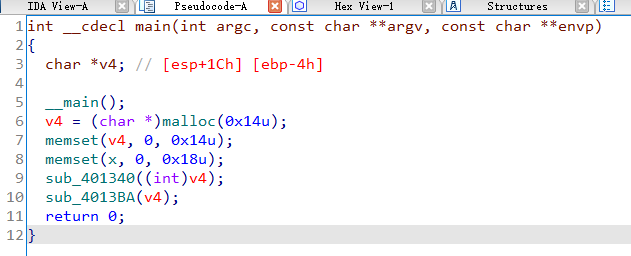
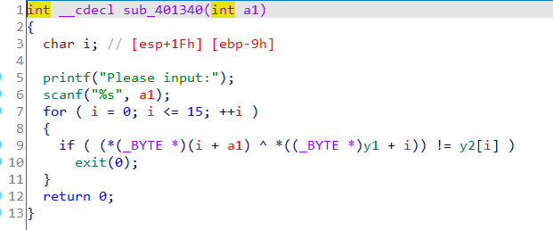
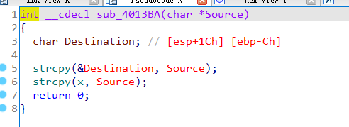
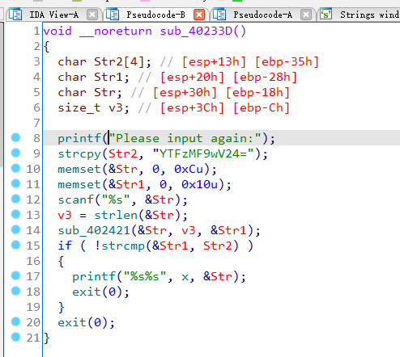
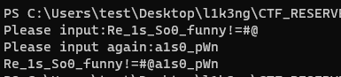

## 0x001 分析程序逻辑

这是一道挺有意思的题~, 首先来看下main函数



这里初始化了 **v4** 和 **x**，给 **v4** 分配了20字节的空间并初始化为0，给 **x** 初始化了24字节的空间。

之后看下函数 **sub_401340**



该函数接收输入，并对其进行了异或加密和校验，如果校验不过直接退出。

如果在上面函数中校验通过，会来到另一个函数 **sub_4013BA**



嗯。。。。这里只是将输入的内容进行了两次拷贝。。。。

## 0x002 第一次加密

OK，这么简单的异或加密算法，就没什么分析的了，直接编写脚本解密

```
key1 = [0x71, 0x04, 0x61, 0x58, 0x27, 0x1E, 0x4B, 0x22, 0x5E, 0x64, 0x03, 0x26, 0x5E, 0x17, 0x3C, 0x7A]
key2 = [0x23, 0x61, 0x3E, 0x69, 0x54, 0x41, 0x18, 0x4D, 0x6E, 0x3B, 0x65, 0x53, 0x30, 0x79, 0x45, 0x5B]

for i,j in zip(key1,key2):
    print (chr(i^j), end="")
```

So Easy!!!，直接得出结果 **Re_1s_So0_funny!**

提交后，结果不对。。。WHY???

## 0x003 第二次加密

懵逼之后，再次分析了下程序，搜索下字符串，发现确实有蹊跷，还有另外一个接收输入的函数。



这个函数里的内容也很简单，对输入的字符串进行base64加密，然后与已有的字符串进行比较，如果成功，则打印两个字符串，上面说的 **x** 和这里输入的 **Str**。

直接对字符串 **YTFzMF9wV24=** 解base64，获取结果 **a1s0_pWn**。

难道是两个字符串拼接到一起提交？ **flag{Re_1s_So0_funny!a1s0_pWn}** 这样？

然后再次提交。。。。结果还是不对。。。。

## 0x004 峰回路转

仔细看了下两个输入函数解得的字符串，**Re_1s_So0_funny!** 和 **a1s0_pWn**，大概意思是说 **re很有趣，pwn也是**，等等，pwn？难道还用到了PWN？

想到前面有用过 **strcpy** 的地方，一定就是这里存在栈溢出。


这里将输入的内容通过 **strcpy** 赋值给了 **Destination**，而 **Destination** 距离返回地址只有16个字节，也就是说，如果输入内容超过16个字节，就会覆盖到返回地址，而且前后并没有对输入的长度进行限制。因此就需要通过溢出覆盖返回地址为第二次加密的地方 **sub_40233D**。由于该地址的十六进制转为可见字符为 **@#=**，内存中是小端存储，因此应该输入 **=#@** 就可以覆盖返回地址为 **0x0040233D**。

这样，在第一个输入的地方应该输入的内容就是 **Re_1s_So0_funny!=#@**，就会来到第二个输入的地方，然后再输入 **a1s0_pWn**，即可获取flag

