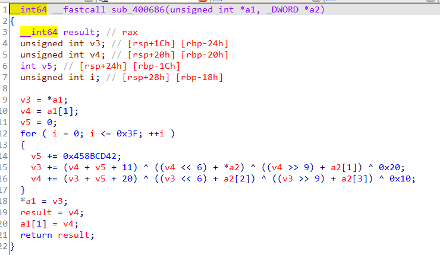

## 0x001 分析程序逻辑

使用IDA pro静态分析，进入main函数分析程序逻辑


首先接收输入，循环内每次输入一个整型数据，循环了六次，也就是说输入的内容是六个整型数据。

之后又进行了三次循环，每次循环输入两个数进行加密。加密函数为 **sub_400686**， 最后在函数 **sub_400770** 中进行校验结果是否正确。

## 0x002 第一次加密 

第一次加密先来分析下加密函数 **sub_400686**



v3、v4为输入的两个数据，之后对v3、v4进行了64次循环加密，在每次的循环加密中进行移位、异或等操作。由于异或可逆，因此该算法可逆。

参数a2为双字节类型，地址是 **dword_601060**，取值为[2, 2, 3, 4]

## 0x003 结果校验 

结果校验函数 **sub_400770**


校验函数将加密结果进行了计算比较。

## 0x004 解密获取Flag

首先从结果校验函数处，可以通过解方程的形式获取加密后的结果，已知三个数值和三个方程，求另外三个数值，可以用z3-solver库进行解方程。

```
from z3 import *
enc_result = [0xDF48EF7E, 0x20CAACF4, 0, 0, 0, 0x84F30420]

x, y, z = Ints("x y z")
sol = Solver()
sol.add(x-y == 0x84A236FF)
sol.add(y+z == 0xFA6CB703)
sol.add(x-z == 0x42D731A8)
if sol.check() == sat:
    result = sol.model()
else:
    sys.exit(0)

enc_result[2] = result.eval(x).as_long()
enc_result[3] = result.eval(y).as_long()
enc_result[4] = result.eval(z).as_long()
```

根据加密后的结果，可以通过逆向 **sub_400686** 中的异或算法，获取正确的输入内容。

循环中有个 **v5**，初始值为0，每次循环自增 0x458BCD42，然后 **v3** 的值是通过 **v4** 的值进行一系列计算获得的，**v4** 的值是通过 **v3** 的值进行一系列计算获得的。因此，逆运算时，首先需要将 **v5** 置到最大值 0x458BCD42 * 64，然后使用 **v3** 计算 **v4**，使用 **v4** 计算 **v3**（计算v3和v4的每个异或过程，可以看作是一个整体），每次循环中 **v5** 依次减去 0x458BCD42。由于 **v3、v4、v5** 的值都是整型的，因此最大不能超过 **0xFFFFFFFF**。

最后通过python3编写解密脚本如下：
```
flag = [0] * 6

for i in range(0,6,2):
    v3 = enc_result[i]
    v4 = enc_result[i+1]
    v5 = 0x458BCD42 * 64
    for j in range(64):
        temp = v5 & 0xfffffffff
        v4 -= (v3+temp+20) ^ ((v3<<6)+3) ^ ((v3>>9)+4) ^ 0x10
        v4 &= 0xffffffff
        v3 -= (v4+temp+11) ^ ((v4<<6)+2) ^ ((v4>>9)+2) ^ 0x20
        v3 &= 0xffffffff
        v5 -= 0x458BCD42
    flag[i] = v3
    flag[i+1] = v4
    
for i in flag:
    print (bytes.fromhex(hex(i)[2:]).decode(), end="")
```