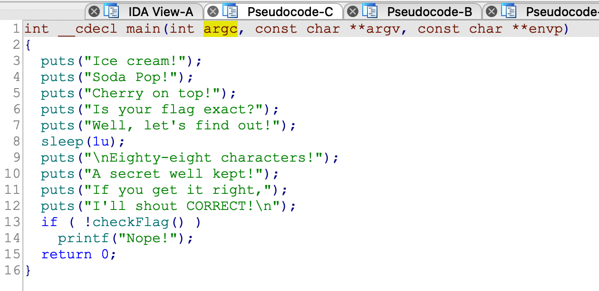
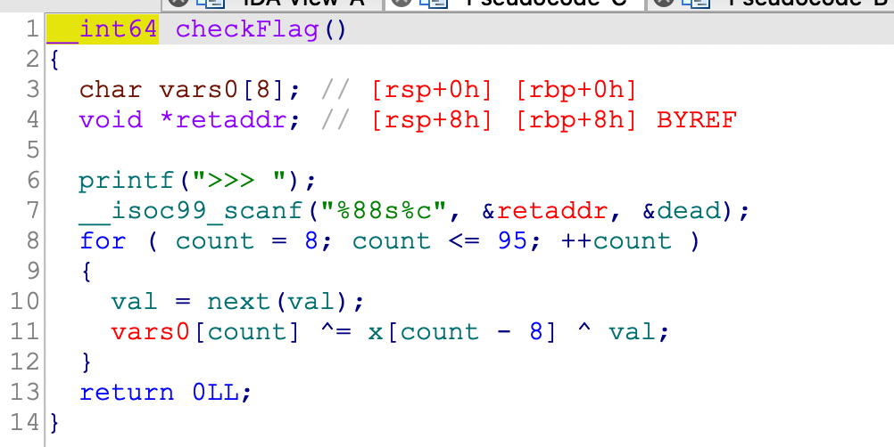
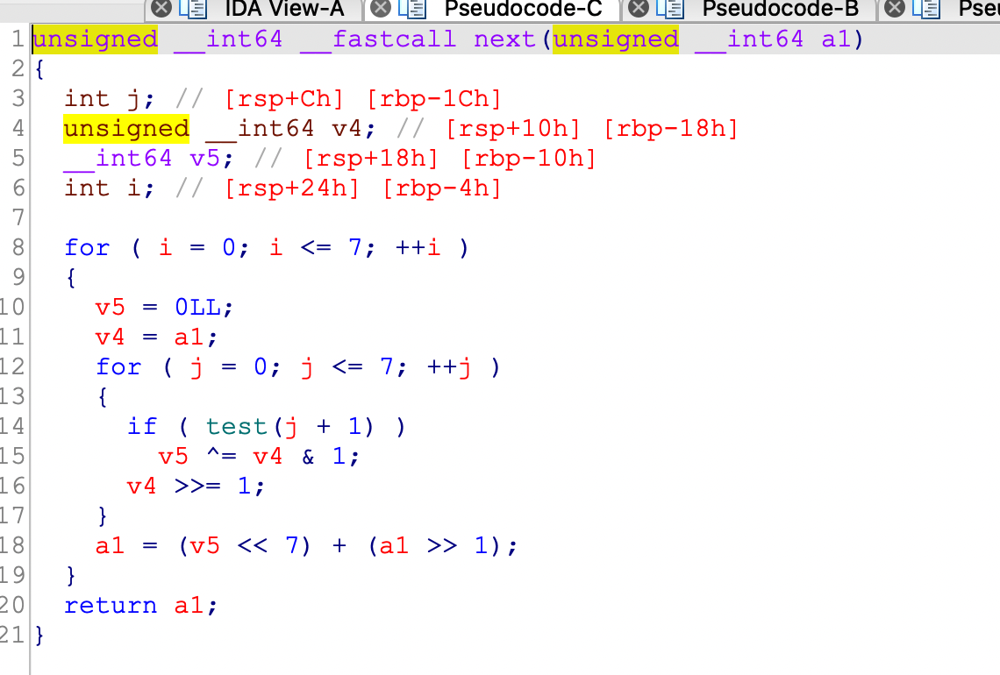
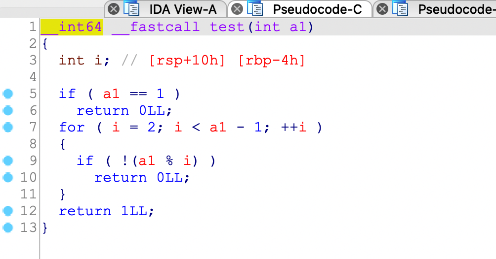
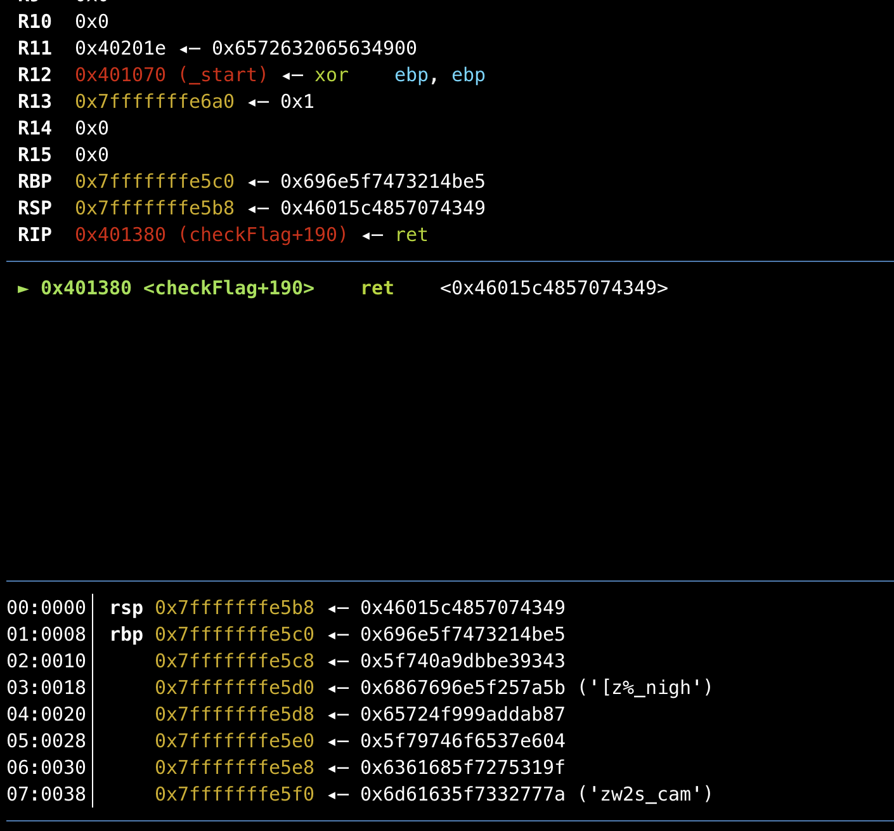
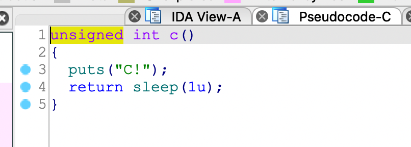
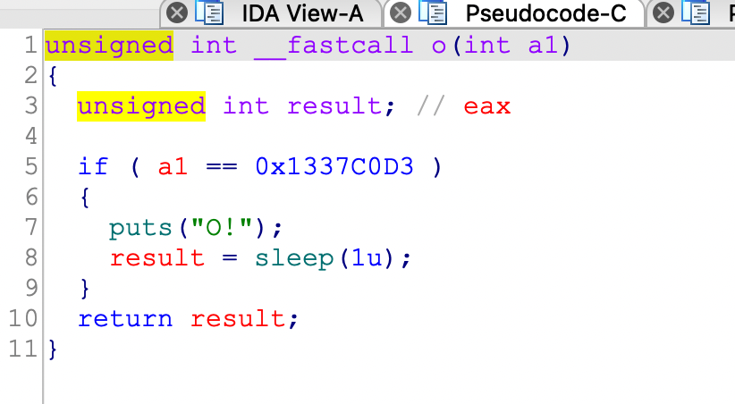
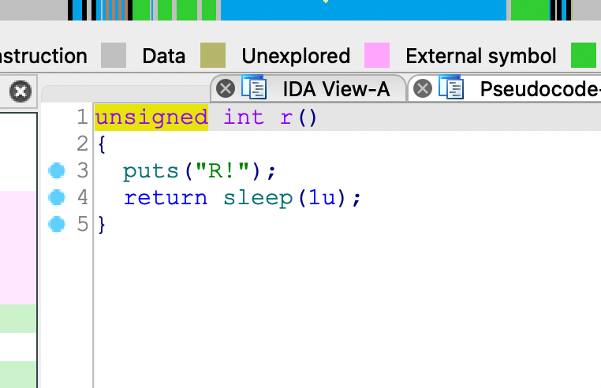
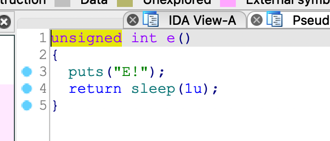
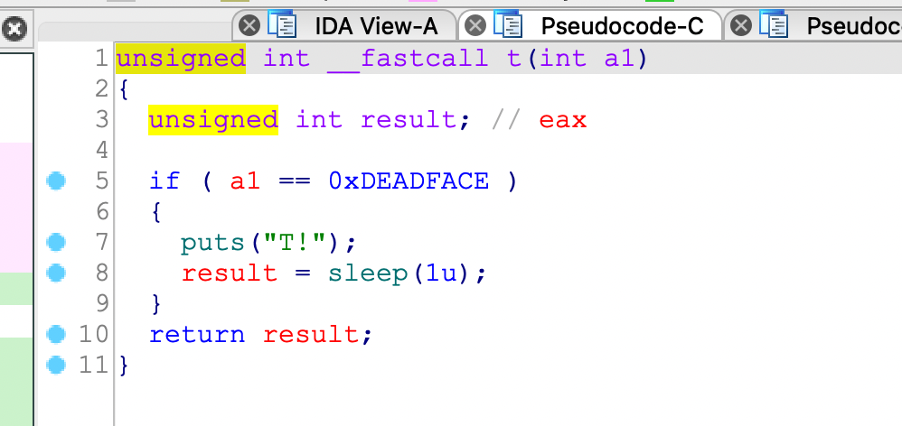

## 0x001 分析程序逻辑

首先来看下main函数



main函数里没什么关键信息，在一通输出后，使用 **checkFlag** 函数来校验。那么来看下 **checkFlag** 函数的内容。



这个函数里使用scanf函数接收输入最大长度为88的字符串，然后对输入的字符串进行加密，每次加密一个字节，总共进行了88次加密。

## 0x002 加密算法分析

在88次循环中，首先使用 **next** 加密了初始值为2的 **val**，然后同表 **x** 中的值和输入的字符进行异或加密，并将结果保存到原来的位置，这个加密形式有点类似于 **OFB** 加密模式。

**next** 函数和 **text** 函数都是固定生成密钥的算法，可以直接拿来使用，暂且不必详细分析。





到这里，该程序的算法已经很清晰了，由于异或加密可逆，因此可以很容易的写出解密算法。

那么现在的关键就是，如何确定输入？由于程序中并没有什么校验的字符串，怎么判断输入的内容是对还是错呢？

## 0x003 结果校验

一番探究无果后，想到题目的提示信息：该程序解密还需要运用一些pwn的知识。既然有pwn，那么就使用GDB来动态研究一波。

使用GDB加载程序，随便输入一些内容后，直接运行，程序断在了 **checkFlag** 函数返回的地方



可以看到，程序挂掉的原因是找不到返回地址，而且可以看到，程序的栈空间被一堆莫名其妙的字节填充了。栈怎么被破坏了？

再次调试分析后，发现原因，在 **checkFlag** 函数中接收的输入，被直接放在了返回地址处。

那么这就明白了，该程序是想让我们通过输入，来控制程序到指定位置，输入的内容经过加密之后变为地址保存在栈中。那么程序到底想跳到哪里执行呢？

回到IDA中，可以看到程序中有这么五个函数，**c**、**o**、**r**、**e**、**t**，











五个函数中分别输出了五个字母，那么可以发挥下想象，这五个字母可以拼成哪些单词呢？

没错就是 **correct**。（不得不说，出题者的想法太骚了）

那么最终校验输入内容是否正确，就是看程序最后是不是可以根据单词顺序依次执行这五个函数。

## 0x004 解密获取Flag

经上述分析后，接下来就很简单了

就是让程序依次执行 **c**、**o**、**r**、**r**、**e**、**c**、**t**，注意，在函数 **o** 和 **t** 中需要通过参数校验。64位程序传参是通过寄存器进行的，一个参数的话就是通过 **RDI** 进行传递，那么在执行到函数 **o** 和 **t** 时，首先需要使用 **POP RDI ; RET** 指令，将栈上的数值保存到 **RDI** 中，然后再返回执行函数内容。

这里获取 **POP RDI ; RET** 指令地址的方法就不多说了。

直接构造地址链如下，这里借助了下pwntools库：
```
p64(c_addr) + p64(pop_rdi_ret) + p64(0x1337C0D3) + p64(o_addr) + p64(r_addr) + p64(r_addr) + p64(e_addr) + p64(c_addr) + p64(pop_rdi_ret) + p64(0xDEADFACE) + p64(t_addr)
```

最后通过解密算法解密地址链，获取flag。

python3解密脚本如下：
```
from pwn import *

key_table = [0xFD, 0x3C, 0xC4, 0x0E, 0x76, 0xFF, 0x4B, 0x45,
             0x1F, 0x40, 0xF4, 0xE6, 0x80, 0xB8, 0xB5, 0xE8,
             0x76, 0x8E, 0x3B, 0xF8, 0xE4, 0xBD, 0xC9, 0xC7,
             0x3F, 0xE6, 0xCF, 0x15, 0x94, 0x9A, 0x8A, 0x28,
             0x4E, 0x5E, 0x1E, 0x3F, 0x25, 0xD4, 0x2C, 0xA9,
             0x36, 0x28, 0x42, 0x40, 0x93, 0x8D, 0x0F, 0xFF,
             0xAE, 0x2B, 0x2B, 0xDF, 0x7E, 0x1A, 0x4E, 0x05,
             0x63, 0xD0, 0x88, 0xE1, 0xA1, 0x1F, 0x5A, 0x3D,
             0x36, 0x4F, 0xAE, 0x89, 0x7B, 0xD7, 0x27, 0xD0,
             0x29, 0xC0, 0x9E, 0xF0, 0x20, 0xDF, 0x69, 0x77,
             0x94, 0xE9, 0x58, 0x0F, 0xB8, 0xEC, 0xF9, 0x24]

def func_text(n):
    if n == 1:
        return 0
    for i in range(2,n-1):
        if not (n % i):
            return 0
    return 1

def func_next(val):
    for i in range(0, 8):
        x = 0
        y = val
        for j in range(0, 8):
            if func_text(j+1):
                x ^= y & 1
            y >>= 1
        val = (x << 7) + (val >> 1)
    return val

def func_decrypt(input_data):
    flag = []
    val = 2
    for idx in range(0, 88):
        val = func_next(val)
        temp = val ^ key_table[idx] ^ int(input_data[idx])
        flag.append(temp)
    return flag

if __name__ == '__main__':
    elf = ELF("./jumprope")

    c_addr = elf.symbols["c"]
    o_addr = elf.symbols["o"]
    r_addr = elf.symbols["r"]
    e_addr = elf.symbols["e"]
    t_addr = elf.symbols["t"]
    pop_rdi_ret = 0x40148b

    input =  p64(c_addr)
    input += p64(pop_rdi_ret) + p64(0x1337C0D3) + p64(o_addr)
    input += p64(r_addr)
    input += p64(r_addr)
    input += p64(e_addr)
    input += p64(c_addr)
    input += p64(pop_rdi_ret) + p64(0xDEADFACE) + p64(t_addr)

    flag = func_decrypt(input)

    for i in flag:
        print (chr(i), end="")
    print ()
```