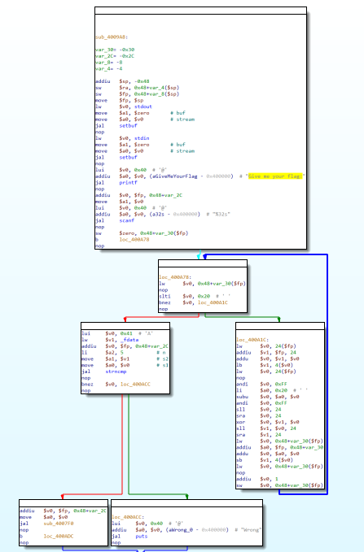
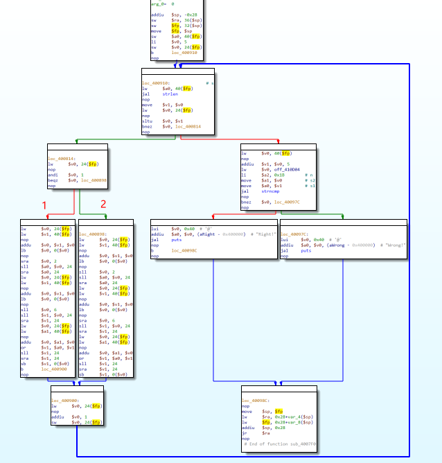
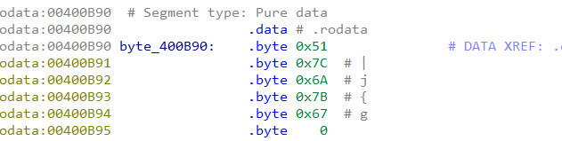
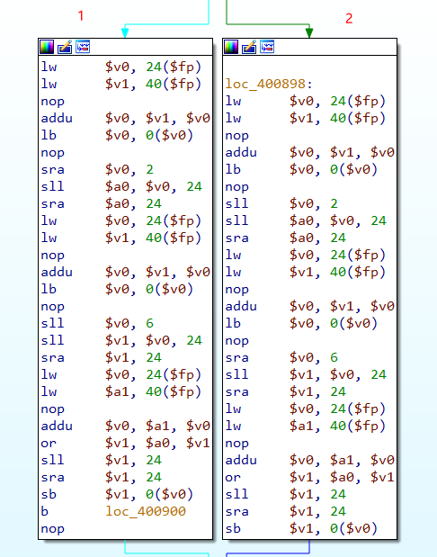
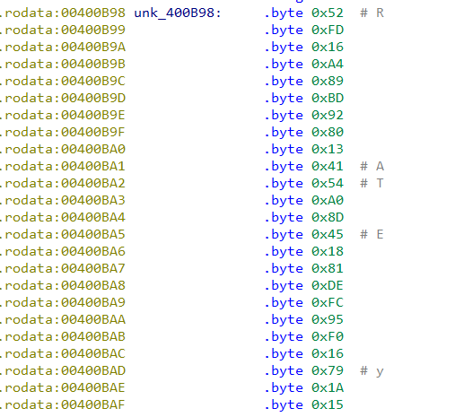

## 0x001 分析程序逻辑

使用IDA pro打开软件，由于IDA本身不支持mips的反汇编，因此只能看汇编代码。

首先通过明显的字符串信息定位到程序入口处，此处IDA生成的流程图如下：



根据流程图可以分析出程序的大体执行流程，得到的伪代码如下：

```
printf("Give me your flag:\n");
scanf("%32s", input);
for (int i=0; i<32; i++) {
    对input[i]进行第一次加密
}

if (strncmp(input, _fdata, 5) != 0) {
    print ("Wrong\n")
} else {
    sub_4007f0()
}
```

接着查看 **sub_4007f0** 函数的流程图如下：



根据流程图可以分析得到的伪代码如下：

```
for (int i=5; i<32; i++) {
    # 第二次加密
    if (i & 1 == 0) {
        分支2
    } else {
        分支1
    }
}

if (strncmp(input+5, off_410D04, 27)==0) {
    printf("Right!");
} else {
    printf("Wrong!");
}

```

可得知程序总共进行了两次加密，下面进行详细分析。

## 0x002 第一次加密 

第一次加密处的汇编代码如下：

```
lw      $v0, 24($fp)            # $v0 = memory[$fp + 24]
addiu   $v1, $fp, 24            # $v1 = $fp + 24
addu    $v0, $v1, $v0           # $v0 = $v0 + $v1
lb      $v1, 4($v0)             # $v1 = memory[$v0 + 4]
lw      $v0, 24($fp)            # $v0 = memory[$fp + 24]
nop
andi    $v0, 0xFF               # $v0 = $v0 & 0xff
li      $a0, 0x20  # ' '        # $a0 = 0x20
subu    $v0, $a0, $v0           # $v0 = $a0 - $v0
andi    $v0, 0xFF               # $v0 = $v0 & 0xff
sll     $v0, 24                 # $v0 = $v0 << 24
sra     $v0, 24                 # $v0 = $v0 >> 24
xor     $v0, $v1, $v0           # $v0 = $v1 ^ $v0
sll     $v1, $v0, 24            # $v1 = $v0 << 24
sra     $v1, 24                 # $v1 = $v1 >> 24
lw      $v0, 24($fp)            # $v0 = memory[$fp + 24]
addiu   $a0, $fp, 24            # $a0 = $fp + 24
addu    $v0, $a0, $v0           # $v0 = $a0 + $v0
sb      $v1, 4($v0)             # $memory[$v0 + 24] = $v1
lw      $v0, 24($fp)            # $v0 = memory[$fp + 24]
nop
addiu   $v0, 1                  # $v0 = $v0 + 1
sw      $v0, 24($fp)            # memory[$fp + 24] = $v0
```

分析后可知，此处对输入的数据进行了异或操作，python还原代码如下：

```
for i in range(len(input)):
    input[i] = (32 - i) ^ ord(input[i])
```

第一次加密后，校验的是前五个字符，校验内容为：



## 0x003 第二次加密 

第二次加密处的汇编代码如下：



此处加密分为两部分，计数器从5开始，当计数器为奇数时，进行的是分支1（循环右移）操作；为偶数时，进行的是分支2（循环左移）。

此处用到的mips指令和上述相同，经分析后，python还原代码如下：

```
for i, j in enumerate(input):
    if (i & 1 == 0):
        ## 循环左移
        input[i] = (j << 2 | j >> 6)
    else:
        ## 循环右移
        input[i] = (j >> 2 | j << 6)
```

第二次加密后，校验的是后27个字符，校验的内容是：



## 0x004 解密获取Flag

解密首先要获取最终的字符串，然后对其进行移位和异或的逆运算。

当字符位于奇数位时，进行循环左移；位于偶数位时，进行循环右移。然后对其进行异或操作，得出flag。

python3解密代码如下：

```
key = [0x51, 0x7C, 0x6A, 0x7B, 0x67, 0x52, 0xFD, 0x16, 
       0xA4, 0x89, 0xBD, 0x92, 0x80, 0x13, 0x41, 0x54, 
       0xA0, 0x8D, 0x45, 0x18, 0x81, 0xDE, 0xFC, 0x95, 
       0xF0, 0x16, 0x79, 0x1A, 0x15, 0x5B, 0x75, 0x1F]

# 循环左移
def rol(val, N, n, l=256):
    result = ((val >> (N - n)) | (val << n)) % l
    return result

# 循环右移
def ror(val, N, n, l=256):
    result = ((val << (N - n)) | (val >> n)) % l
    return result

flag = ""
for i, j in enumerate(key):
    if i < 5:
        flag += chr(j ^ (32 - i))
    else:
        if i % 2 == 0:
            flag += chr(ror(j, 8, 2) ^ (32 - i))
        else:
            flag += chr(rol(j, 8, 2) ^ (32 - i))

print (flag)
```