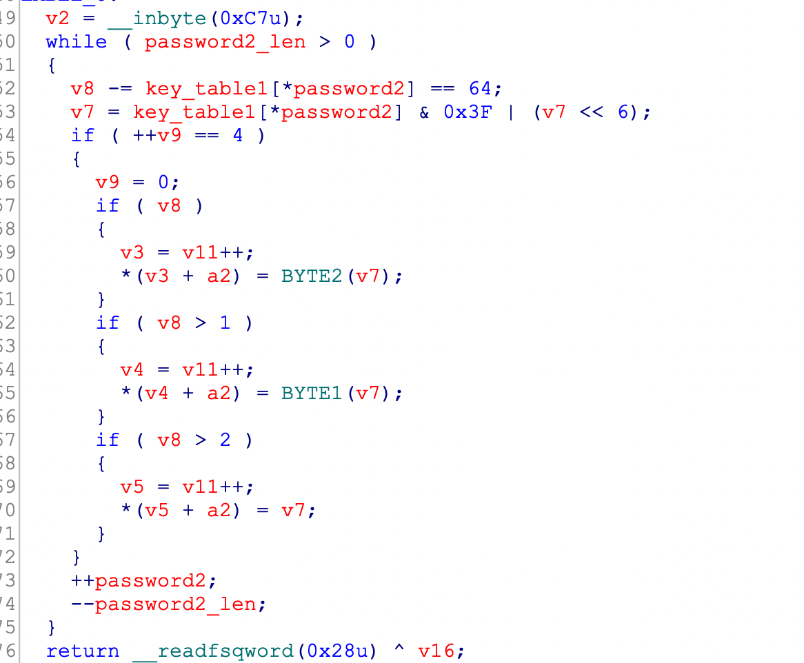
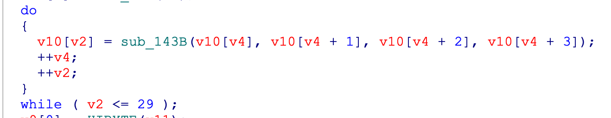
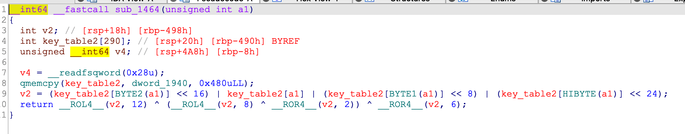

## 0x001 分析程序逻辑

使用IDA pro打开软件，来到main函数中，但是代码处显示红色，而且无法创建函数。


这是由于程序里存在花指令，导致IDA无法正常解析，需找到并nop掉花指令后，再使用快捷键p创建函数，之后就可以正常分析了。

其中的一处花指令如下：


去除完花指令，查看main函数内容：

1. 提示输入 **password1**；
2. 对 **password1** 进行校验，校验通过后，提示输入 **password2**；
3. 对 **password2** 进行校验，校验通过后，提示输入 **password3**；
4. 对 **password3** 进行校验，校验通过后，输出 **flag**；

三个输出对应了三个加密函数，输入彼此间没什么关联，最后的flag就是将这三个输出拼接到一起的。

## 0x002 第一个算法

第一个加密处对应的是一个 **5 * 25** 的迷宫，迷宫形状如下：


走迷宫对应的规则如下：


总共六个操作：
1. w：向上一步
2. s：向下一步
3. d：向左一步
4. a：向右一步
5. x：向下五步
6. y：向上五步

每走一步，都会进行判断，如果走到的是 **\*** 符号，则失败；如果走到的是 **#** 符号，则成功。

按理说操作应该是很简单的，直接四步 **sxss** 即可走到 **#** 处，获得胜利。但是这个程序应该是存在bug或者多解，最后的flag输入 **sxss** 并不对。。。。猜测出题者有可能是想让把所有的 **.** 符号都走一遍。。。。不管他了，思路更重要！

## 0x003 第二个算法

第二个算法是对输入的 **password2** 进行一系列操作后等于 **sctf_9102** 就对了。下面来详细看看这一系列操作。



代码首先根据输入字符的ascii码，在 **key_table1** 中索引出相对应的值，然后和 **0x3F** 进行按位与操作，之后同 **v7<<6** 进行按位或操作，重复4次。**0x3F** 的二进制表示为 **111 111**，按位与 **0x3F** 就表示只取低6bit位。**v7<<6** 为左移6bit位。因此，**key_table1[\*password2] & 0x3F | (v7<<6)** 可解读为 **v7** 左移6bit位后补的0，由 **key_table1[\*password2]** 的低6bit位填充。

图解示意图如下：

假设输入的字符从 **key_table1** 中索引出的值是依次是A、B、C、D


分析到这，发现这种 **4变3** 的操作应该就是base64解码。然后对照着base64编码表看了下 **key_table1**， 实锤了。

## 0x004 第三个算法


首先是将输入的字符串每四个字符为一组，将这四个字符转换为整数。如 **ABCD** 转换完等于 **0x41424344**，后面的 **sub_78A** 中调用是 **_byteswap_ulong(a1)**， 该函数是将大端序转换为小端序，如 **0x41424344** 转换成小端序就等于 **0x44434241**。

然后对转换完的整数进行加密：





这里总共进行了26次循环，每次循环都将前四个数据的加密结果赋值给第五个，如此循环。

```
v10[4] = v10[0] ^ encode(v10[1] ^ v10[2] ^ v10[3])
v10[5] = v10[1] ^ encode(v10[2] ^ v10[3] ^ v10[4])
...
...
v10[29] = v10[25] ^ encode(v10[26] ^ v10[27] ^ v10[28])
```

由此可见v10数组里总共30个元素，前四个元素是由输入转换的初始值，后面的元素都是由其前四个元素计算得到的。

算法首先是异或，然后将异或的结果分为四个8bit位的值，将这四个值作为下标从 **key_table2** 表中获取数据，然后将从表中取出的四个数据按照高低位重新组合，最后再进行循环左移和循环右移。

最后是校验v10的后四个元素，也就是v11=v10[26]，v12=v10[27]，v13=v10[28]，v14=v10[29]

将这四个元素从高位到低位，每8bit位做为一个字符赋值给 **v9**，然后比较。


## 0x005 解密获取Flag

第一个算法和第二个算法可以直接获取结果，略过。

第三个算法是个可逆的算法，并且函数 **sub_1464** 可以直接使用。加密时，是已知前四个元素，获取最后四个元素，解密就是已知最后的四个元素，反推前四个元素。

python3解密代码如下：

```
# 循环左移
def rol(val, N, n):
    result = ((val >> (N - n)) | (val << n)) & 0xffffffff
    return result

# 循环右移
def ror(val, N, n):
    result = ((val << (N - n)) | (val >> n)) & 0xffffffff
    return result

def sub_1464(value):
    byte1 = value & 0xff
    byte2 = (value >> 8) & 0xff
    byte3 = (value >> 16) & 0xff
    byte4 = (value >> 24) & 0xff
    
    new_value = (key_table2[byte3] << 16) | key_table2[byte1] | (key_table2[byte2] << 8) | (key_table2[byte4] << 24)
    result = rol(new_value, 32, 12) ^ (rol(new_value, 32, 8) ^ ror(new_value, 32, 2)) ^ ror(new_value, 32, 6)
    return result

if __name__ == '__main__':
    data = [ 0 ] * 26 + [0xBE040680] + [0xC5AF7647] + [0x9FCC401F] + [0xD8BF92EF]

    for i in range(25, -1, -1):
        data[i] = data[i+4] ^ sub_1464(data[i+2] ^ data[i+3] ^ data[i+1])

    for j in data[:4]:
        print (bytes.fromhex(hex(j)[2:])[::-1].decode(), end="")
```

## 0x006 附录-python3版本的第三个加密算法

```
key_table2 = [0xD6, 0x90, 0xE9, 0xFE, 0xCC, 0xE1, 0x3D, 0xB7,
              0x16, 0xB6, 0x14, 0xC2, 0x28, 0xFB, 0x2C, 0x05,
              0x2B, 0x67, 0x9A, 0x76, 0x2A, 0xBE, 0x04, 0xC3,
              0xAA, 0x44, 0x13, 0x26, 0x49, 0x86, 0x06, 0x99,
              0x9C, 0x42, 0x50, 0xF4, 0x91, 0xEF, 0x98, 0x7A,
              0x33, 0x54, 0x0B, 0x43, 0xED, 0xCF, 0xAC, 0x62,
              0xE4, 0xB3, 0x1C, 0xA9, 0xC9, 0x08, 0xE8, 0x95,
              0x80, 0xDF, 0x94, 0xFA, 0x75, 0x8F, 0x3F, 0xA6,
              0x47, 0x07, 0xA7, 0xFC, 0xF3, 0x73, 0x17, 0xBA,
              0x83, 0x59, 0x3C, 0x19, 0xE6, 0x85, 0x4F, 0xA8,
              0x68, 0x6B, 0x81, 0xB2, 0x71, 0x64, 0xDA, 0x8B,
              0xF8, 0xEB, 0x0F, 0x4B, 0x70, 0x56, 0x9D, 0x35,
              0x1E, 0x24, 0x0E, 0x5E, 0x63, 0x58, 0xD1, 0xA2,
              0x25, 0x22, 0x7C, 0x3B, 0x01, 0x21, 0x78, 0x87,
              0xD4, 0x00, 0x46, 0x57, 0x9F, 0xD3, 0x27, 0x52,
              0x4C, 0x36, 0x02, 0xE7, 0xA0, 0xC4, 0xC8, 0x9E,
              0xEA, 0xBF, 0x8A, 0xD2, 0x40, 0xC7, 0x38, 0xB5,
              0xA3, 0xF7, 0xF2, 0xCE, 0xF9, 0x61, 0x15, 0xA1,
              0xE0, 0xAE, 0x5D, 0xA4, 0x9B, 0x34, 0x1A, 0x55,
              0xAD, 0x93, 0x32, 0x30, 0xF5, 0x8C, 0xB1, 0xE3,
              0x1D, 0xF6, 0xE2, 0x2E, 0x82, 0x66, 0xCA, 0x60,
              0xC0, 0x29, 0x23, 0xAB, 0x0D, 0x53, 0x4E, 0x6F,
              0xD5, 0xDB, 0x37, 0x45, 0xDE, 0xFD, 0x8E, 0x2F,
              0x03, 0xFF, 0x6A, 0x72, 0x6D, 0x6C, 0x5B, 0x51,
              0x8D, 0x1B, 0xAF, 0x92, 0xBB, 0xDD, 0xBC, 0x7F,
              0x11, 0xD9, 0x5C, 0x41, 0x1F, 0x10, 0x5A, 0xD8,
              0x0A, 0xC1, 0x31, 0x88, 0xA5, 0xCD, 0x7B, 0xBD,
              0x2D, 0x74, 0xD0, 0x12, 0xB8, 0xE5, 0xB4, 0xB0,
              0x89, 0x69, 0x97, 0x4A, 0x0C, 0x96, 0x77, 0x7E,
              0x65, 0xB9, 0xF1, 0x09, 0xC5, 0x6E, 0xC6, 0x84,
              0x18, 0xF0, 0x7D, 0xEC, 0x3A, 0xDC, 0x4D, 0x20,
              0x79, 0xEE, 0x5F, 0x3E, 0xD7, 0xCB, 0x39, 0x48,
              0xC6, 0xBA, 0xB1, 0xA3, 0x50, 0x33, 0xAA, 0x56,
              0x97, 0x91, 0x7D, 0x67, 0xDC, 0x22, 0x70, 0xB2,
              0x00, 0x00, 0x00, 0x00, 0x00, 0x00, 0x00, 0x00,
              0x00, 0x00, 0x00, 0x00, 0x00, 0x00, 0x00, 0x00]

# 循环左移
def rol(val, N, n):
    result = ((val >> (N - n)) | (val << n)) & 0xffffffff
    return result

# 循环右移
def ror(val, N, n):
    result = ((val << (N - n)) | (val >> n)) & 0xffffffff
    return result

def sub_1464(value):
    byte1 = value & 0xff
    byte2 = (value >> 8) & 0xff
    byte3 = (value >> 16) & 0xff
    byte4 = (value >> 24) & 0xff
    
    new_value = (key_table2[byte3] << 16) | key_table2[byte1] | (key_table2[byte2] << 8) | (key_table2[byte4] << 24)
    result = rol(new_value, 32, 12) ^ (rol(new_value, 32, 8) ^ ror(new_value, 32, 2)) ^ ror(new_value, 32, 6)
    return result

if __name__ == '__main__':
    
    password3 = "fl4g_is_s0_ug1y!"
    data = [ 0 ] * 30
    
    for i, j in zip(range(0, len(password3), 4), range(0, 4)):
        temp1 = (ord(password3[i]) << 24 | ord(password3[i+1]) << 16 | ord(password3[i+2]) << 8 | ord(password3[i+3]))
        temp2 = bytes.fromhex(hex(temp1)[2:])[::-1]
        data[j] = int(''.join(['%02x' % b for b in temp2]), 16)

    for i, j in zip(range(4, 30), range(0, 26)):
        data[i] = data[j] ^ sub_1464(data[j+1] ^ data[j+2] ^ data[j+3])
        
    enc_result = []
    for value in data[-4:]:
        enc_result.append((value >> 24) & 0xff)
        enc_result.append((value >> 16) & 0xff)
        enc_result.append((value >> 8) & 0xff)
        enc_result.append(value & 0xff)

    print (enc_result)
```

## 0x007 附录-IDA Pro宏定义

这个程序里有几个IDA Pro宏定义，简单说明一下：

1. BYTEn
    
    获取8bit的数据，n表示获取的位置。

    **LOBYTE** 表示获取低8bit位数据

    **BYTE1** 表示获取 **LOBYTE** 之后的8bit位数据

    **BYTE2** 表示获取 **BYTE1** 之后的8bit位数据

    **HIBYTE** 表示获取高8bit位数据

2. \_\_ROLn\_\_ 和 \_\_RORn\_\_

    循环左移和循环右移，n表示最大长度。如n=4，则\_\_ROR4\_\_表示循环右移的最大长度为 4 * 8bit = 32bit