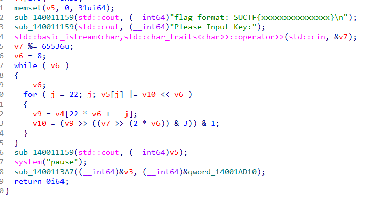

## 0x001 分析程序逻辑

使用IDA pro打开软件，根据字符串特征，来到main函数中



程序逻辑就是输入一个数字，经过算法计算，会生成一个字符串，输入的数据不同，生成的字符串也不同。

因此，只有输入正确的数字，才会输出flag。根据前面的输出提示，flag格式为 **SUCTF{xxxxxxxxxxxxx}**

## 0x002 算法分析

这里的算法也很简单，就是根据输入的数字以及表 **v4** 中的值进行计算，将结果保存到 **v5** 中。

## 0x005 解密获取Flag

可以直接爆破输入的数字，数字范围为1-65535，直接用所给的算法，看每个数字计算后输出的结果是否符合flag格式，如果符合，即为flag。

python3暴破脚本：

```
table = [.....]

for input in range(1, 65537):
    result = [0] * 30
    for i in range(7, -1, -1):
        for j in range(21, -1, -1):
            v9 = table[22 * i + j]
            v10 = (v9 >> ((input >> (2 * i)) & 3)) & 1
            result[j] |= (v10 << i)
    
    if (result[0] == ord('S')) and \
        (result[1] == ord('U')) and \
        (result[2] == ord('C')) and \
        (result[3] == ord('T')) and \
        (result[4] == ord('F')):
        for a in result:
            print (chr(a), end="")
        print ("")
        break
```