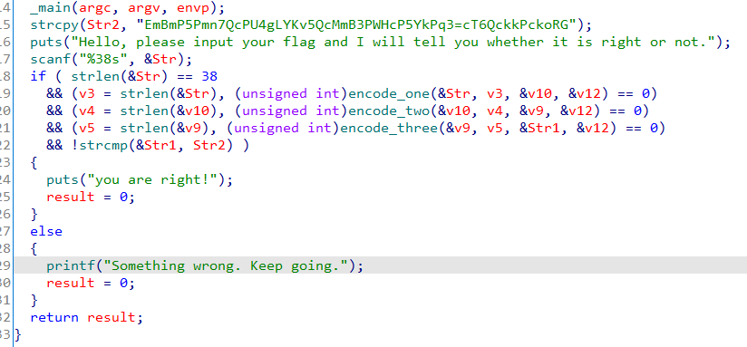
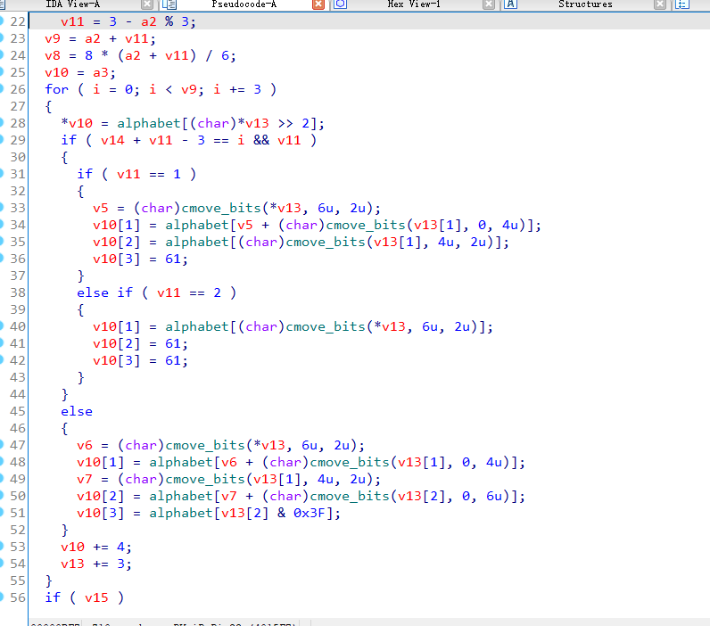
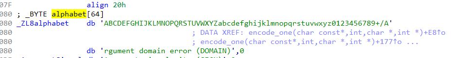
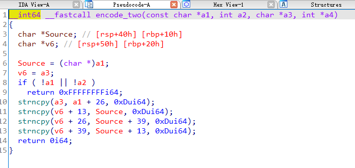
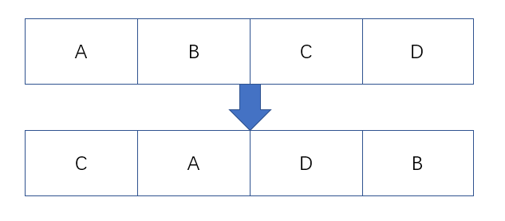
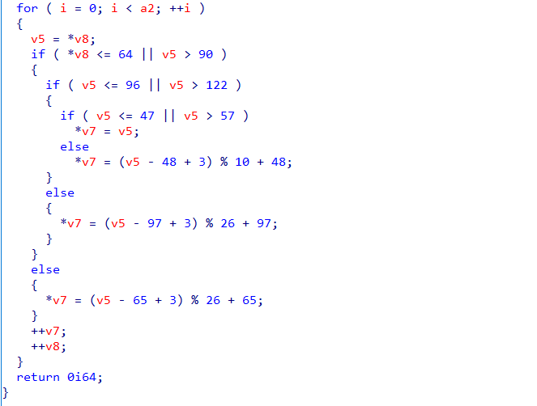

## 0x001 分析程序逻辑

使用IDA pro打开软件，分析执行流程



首先将字符串 **EmBmP5Pmn7QcPU4gLYKv5QcMmB3PWHcP5YkPq3=cT6QckkPckoRG** 拷贝到 **Str2** 中，之后接收输入到 **Str**，之后对 **Str** 进行了三次加密，并将最后的加密结果存放到了 **Str1** 中，最终同 **Str2** 比较。因此需要通过 **Str2** 的值逆向推出输入的 **Str1**。

## 0x002 第一次加密 encode_one

进入encode_one函数查看





根据字符串特征可知，encode_one为base64加密。

## 0x003 第二次加密 encode_two

进入encode_two函数查看



此处将base64加密后的值进行分组，每13位为一组，分为四组，然后将这四组数据重新排序。



## 0x004 第三次加密 encode_three

进入encode_three函数查看



第三次加密会遍历字符串，并对每个字符进行如下操作：

1. 如果字符为数字0-9，则进行 **(v5 - 48 + 3) % 10 + 48** 操作；
2. 如果字符为小写字母a-z，则进行 **(v5 - 97 + 3) % 26 + 97** 操作；
3. 如果字符为大写字母A-Z，则进行 **(v5 - 65 + 3) % 26 + 65** 操作；
4. 如果不是以上三种类型，那么就保持原值。

分析后可知该算法为凯撒加密，位移为3。

## 0x005 解密获取Flag

解密步骤：凯撒解密->分组移位->base64解密

个人理解凯撒解密的思路：

1. 根据位移和明文表建立加密表；
2. 遍历加密文本，获取每个字符在加密表中的位置；
3. 根据字符在加密表中的位置，在明文表中获取对应的值。

python3凯撒解密代码如下：

```
number_char_decode_dict = "0123456789"
lower_char_decode_dict = "abcdefghijklmnopqrstuvwxyz"
upper_char_decode_dict = "ABCDEFGHIJKLMNOPQRSTUVWXYZ"

number_char_encode_dict = ""
lower_char_encode_dict = ""
upper_char_encode_dict = ""

def set_encode_dict(number_move, lower_move, upper_move):
    global number_char_encode_dict
    global lower_char_encode_dict
    global upper_char_encode_dict
    
    for i,j in enumerate(number_char_decode_dict):
        number_char_encode_dict += chr((ord(j) - 48 + number_move) % 10 + 48)
        
    for i,j in enumerate(lower_char_decode_dict):
        lower_char_encode_dict += chr((ord(j) - 97 + lower_move) % 26 + 97 )
        
    for i,j in enumerate(upper_char_decode_dict):
        upper_char_encode_dict += chr((ord(j) - 65 + upper_move) % 26 + 65)

def caesar_encode(cipher_text):
    decode_result = ""
    
    for i,j in enumerate(cipher_text):
        if j in number_char_encode_dict:
            idx = number_char_encode_dict.find(j)
            decode_result += number_char_decode_dict[idx]
        elif j in lower_char_encode_dict:
            idx = lower_char_encode_dict.find(j)
            decode_result += lower_char_decode_dict[idx]
        elif j in upper_char_encode_dict:
            idx = upper_char_encode_dict.find(j)
            decode_result += upper_char_decode_dict[idx]
        else:
            decode_result += j
            
    print (decode_result)

    # 解密结束后，进行分组移位的逆运算
    DataText1 = re.findall(r'.{13}', decode_result)
    DataText2 = [0] * 4
    DataText2[0] = DataText1[1]
    DataText2[1] = DataText1[3]
    DataText2[2] = DataText1[0]
    DataText2[3] = DataText1[2]
    DataText3 = "".join(DataText2)

    # 最后解密base64获取flag
    print (base64.b64decode(DataText3).decode())
```